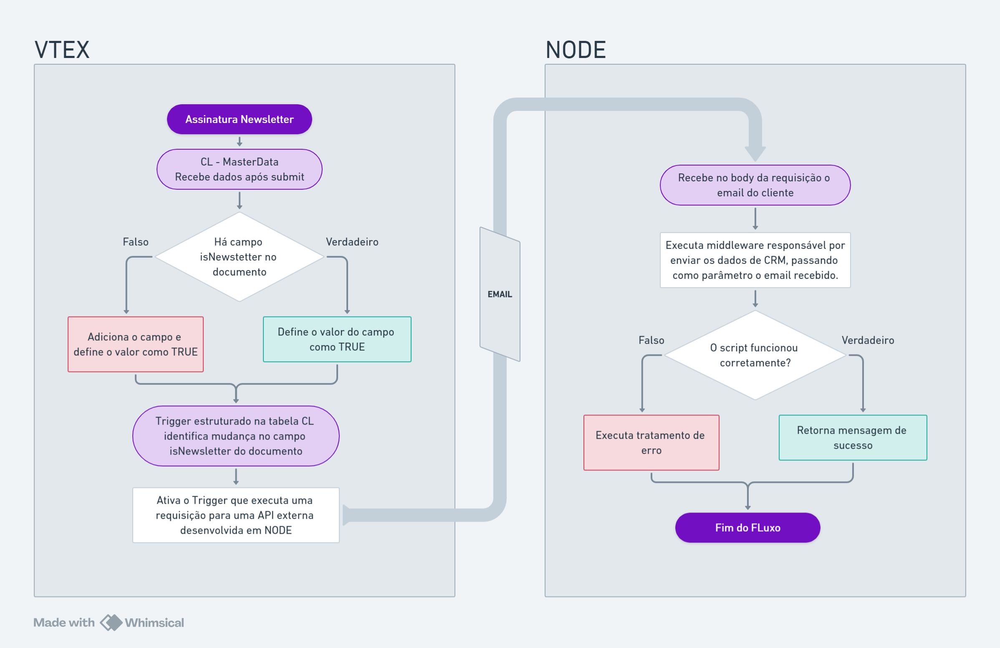

# Atividade 05

### [Link do Fluxograma](https://whimsical.com/atividade-05-4JnBc28hEDpT4vDQZgbyD4@6HYTAunKLgTUmphvA2dCS3TPjCAxLjUwWvoSTPurv4GLdze)

## Explicação

O Master Data, sendo um serviço que permite armazenar e gerenciar dados de clientes, produtos, pedidos e outras entidades essenciais para o funcionamento de uma loja online, também nos oferece alguns recursos que vão além do gerenciamento de dados. Uma das funcionalidades muito úteis para o propósito de disparos com certeza é o `Trigger`.

O `Trigger`, nada mais é do que uma funcionalidade que permite que, quando uma alteração ocorra em um documento de uma entidade, alguma outra ação ocorra (disparo de
e-mail, alteração em outro documento etc).

Pensando nisso, eu imagino que uma solução cabível em relação a tarefa de enviar ao serviço de CRM todos os emails cadastrados na newsletter, seria uma implementação de um `Trigger` na tabela `CL`.

A partir disso nós poderíamos criar um ouvinte que fica observando o valor do campo `isNewsletter`, e assim que fosse identificada alguma mudança, disparar o gatilho que terá como única responsabilidade, pegar o email presente no documento, e enviar através de uma requisição `HTTP` para uma rota de uma `API` desenvolvida em `NODE`.

Esse `NODE` teria o objetivo de receber o email no body da requisição, que sucessivamente será utilizado em outra requisição, dessa vez para o serviço de `CRM`.
O middleware deve ser capaz de realizar todos os tratamentos necessários, tanto de sucesso quanto de erro.

Essa conclusão foi baseada em uma experiência pessoal, onde eu tinha uma necessidade semelhante ao da atividade, que seria enviar dados para uma API externa, baseado na atualização de dados da tabela `CL` que eram observados através de uma `Trigger`. Na época cheguei a utilizar a `V1` do Master Data.

